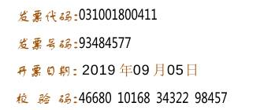
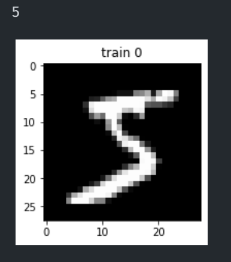

# 发票 OCR - 数字识别的简单实现

本教程旨在使用简单的操作步骤实现一个简单的发票上的数字视频。


我们不追求识别率和速度，目的只是想让大家初步体验一下人工智能和计算机视觉 CV。


## 大体思路

- 解析图像 转换为 灰度图
- 二值化处理
- 截取到需要的数据
- 使用矩阵存储图片
- 人为预先设好一些数据
- 矩阵之间进行比较
- 预测
- 输出


## 处理的准备

图片大小 1218*788

待识别的区域是固定的，我们只识别右上角部分的数字。


使用 `opencv` 进行图片的找轮廓等处理，`pillow` 进行图片的处理。

配合其他的一些库进行更方便的处理，安装请参考下面的教程。


## 开始实践

从我们上面的已知部分来看，我们的计划似乎是完美的，实际上手操作后，处处都有困难...不管如何，先做起来再说！


### 环境搭建

如果大家有虚拟环境可以使用虚拟环境:

```python
# 创建新的虚拟环境
python -m virtualenv myenv

# 进入虚拟环境
source myenv/bin/activate

# 安装
pip install -r requirements.txt
```


也可以直接使用 pip 安装


```bash
pip install -r requirements.txt
```


这样在使用一些第三方库的时候就不会出现找不到的问题了。


如果使用 Anaconda 

```bash
conda create --name myenv python=3.8

conda activate myenv

conda install --file requirements.txt
```


提前安装好环境，后面实践部分就会得心应手一些。


### 数据集准备

在完成机器学习的项目中，这部分实际上是相对而言最花时间的地方。

我们要做的项目的数据集有时候不是那么丰富。比如我们的这个项目，发票这个东西是涉及到个人隐私的，一般是没有那么多的数据集提供给我们使用的，在这里我为大家提供了我在电商平台上买的一些东西的真实电子发票。

一共 5 张，存储在 **invoice-images** 文件夹下。


我们这次的目标就是发票的右上角部分，我们这次的目标是能够识别出来数字即可。


目标已经选好，我们就可以开始进行预处理了。


### 预处理


首先我们只要一部分的数据，那我们要截取那部分的图片即可，不能截的过大，否则可能会影响到我们的识别，也不能过小，这样我们在对每个数字进行分割的时候反而不方便。


```python
# 打开图片
im = Image.open("./invoice-images/test2.png")

# 截取图片
code = im.crop((850, 15, 1180, 155))

# 保存
code.save("./out/cut.png")
```


这里的我们传进去一个 `Tuple` ，指定我们截取的矩形的两个对角的坐标。

之后我们将其保存到本地。


运行上述代码之后我们就可以看到截好的图片(`cut.png`)了：





接下来我们就进一步的细化我们的处理：进行二值化。

所谓二值化，即将一张图片转换成黑白的样子，这个 **黑白** 和我们平时拍照用的那个滤镜的黑白有点不同，他的黑是**真的黑 RGB(255,255,255)** 白则是**真的白 RGB(0,0,0)** ，真正的非黑即白。


但在这之前我们先要将他转换成灰度图，也就是我们平时能经常看到的 “黑白滤镜” 那个效果。


```python
# 读取图片
img = cv2.imread("./out/cut.png")

# 转换
gray = cv2.cvtColor(img, cv2.COLOR_BGR2GRAY)

# 保存
cv2.imwrite("./out/gray.jpg", gray)
```


这样我们就获得了一个灰度化后的图像(`gray.jpg`)：


之后我们对其进行二值化

```python
# 阈值分割
ret, thresh = cv2.threshold(gray, 95, 255, 1)

cv2.imwrite("thresh.jpg", thresh)
```


`threshold()` 函数的参数 参考 [OpenCV基础——threshold函数的使用](https://blog.csdn.net/u012566751/article/details/77046445)

- img - 待处理的图片
- thresh - 阈值
- maxval - 最大值
- type - 阈值类型


我们倒着一一讲述：

> 阈值类型
>
> 我们选择的是 1 ，即大于阈值的变为 白，小于阈值的变为 最大值即我们这里设置的黑


> 最大值
>
> 为一个灰度值，与阈值类型结合使用。


> 阈值
>
> 这个是整个函数最关键的一个点。这个数值的大与小将直接决定我们后面的效果。


我这里的 95 是使用 Photoshop 对几个点测量灰度值和几次尝试之后设置的一个值，大家可以尝试下不同的值的效果：


从上往下值依次是 60, 95, 120 


我们可以看到，值比较小的时候我们数字会出现不连贯，不完整的现象，在比较大的时候会显得有一点粗，但是会有其他的一些杂项引入进来，比如说第三行年月日部分三个中文汉字已经有点隐隐约约的显现出来了。


我们不妨就采用 95，让其他的文字稍微的显示出一点点，毕竟天下没有免费的午餐嘛。


> img 待处理的图片，传入我们的灰度化后的图片。


### 寻找数字


我们对图像预处理好了，下一步则是对其中的数字进行提取。


我们这里使用 `opencv` 提供的寻找轮廓的功能。这个方法的实现，我们暂且不需要理解底层的原理，会使用就可以了。


```python
contours, hier = cv2.findContours(thresh, cv2.RETR_EXTERNAL, cv2.CHAIN_APPROX_SIMPLE)
```


这里我们传入二值化的数据(`thresh`)，同时选择只识别最外面的一层轮廓(`cv2.RETR_EXTERNAL`)，不然有些数字如 0，里面可能还会有一圈。后面我们则选择 仅保留轮廓上的拐点信息(`cv2.CHAIN_APPROX_SIMPLE`)，即关键点，这样就足够我们使用的了，不需要太详细的轮廓点。


输出一下找好轮廓的图片：


```python
# 遍历所有的轮廓
for i in range(0, len(contours)):
    # 取得轮廓的起始点 x,y  与该点分别向 横、纵 延伸的距离
    x, y, w, h = cv2.boundingRect(contours[i])
    print((x, y), (x + w, y + h))
    # 画出框框
    cv2.rectangle(img, (x, y), (x + w, y + h), (255, 0, 255), 1)

# 保存
cv2.imwrite("./out/save.jpg", img)
```


看起来还不错，接下来的任务则是把他们给分别的截取下来，我们要识别的是一个个的单独的数字。


但是我们要注意到，有一些文字的部分内容也被圈起来了，这部分是我们不想要的，因此我们要想办法去除掉。


观察一下，我们会发现数字的框框要大一些，我们不想要的框框往往都是一些小部分，于是我们这里不妨简单粗暴一些：直接根据像素的多少决定要不要


```python
for i in range(0, len(contours)):
    x, y, w, h = cv2.boundingRect(contours[i])
    # print((x, y), (x + w, y + h))
    # cv2.rectangle(img, (x, y), (x + w, y + h), (255, 0, 255), 1)

	# 75 是个神秘的数字
    if h * w >= 75:
        # 截取图片，注意这里先传入 y 再传入 x
        newimage = thresh[y : y + h , x  : x + w ]
        # 保存
        cv2.imwrite("./result/" + str(i) + ".jpg", newimage)
```


这里我们规定了 75 作为分解的值，因为预设数据集(已经截取好的10个数字图片)是我使用第一张测试图片(`test1.png`)截取的结果，经过统计之后我认为这个值作为阈值是比较合适的。


现在，我们打开 result 文件夹就能看到一堆图片了。这些图片都是我们截取下来的单独的数字。


### 预设数据

这里我提供给了大家已经截好的二值化后的 0-9 的数字，他们的大小大概都在 12x7 左右。


因为我们要比较两个图片的相似程度，我们不妨先把这里图片转换成矩阵的形式，方便后面进行使用：

```python
# 导包 我们这里使用 Pillow 包 导入的时候名字为 PIL
from PIL import Image 
import numpy as np
import os

# 预设图片的地址
preset_path = "./number-preset-dataset"

# 用来储存转换之后的矩阵
store = {}

# 写一个方法，方便后面调用
def get_preset():
    for root, dirs, files in os.walk(preset_path):
        for f in files:
            # 得到完整的路径 即 './preset/0.jpg'
            file_full_path = os.path.join(root, f)
            
            # 用 Pillow 中的 Image.open 打开图像
            image = Image.open(file_full_path) 
            
            # 转化成 numpy 数组
            arr = np.array(image) 
            
            # 对文件名分割 如 0.jpg => ('0', 'jpg')
            file_ext = f.rsplit('.', maxsplit=1)
            # 得到文件名 文件名即是这个图片的真实数字
            file_name = file_ext[0]
            
            # 存到字典中
            store[file_name] = arr
```


这样我们就得到了一个以数字的值为键，数字图片的矩阵作为值的一个字典。


### 比较


万事俱备，我们就差最后一步了！


这时候我们只要比较两个矩阵之间的相似程度，排序一下，就能知道这个图片更像哪个数字了。


两个矩阵之间的相似程度比较，我们首先想到的一个简单直观 的方法：[余弦相似度法](https://www.jianshu.com/p/613ff3b1b4a8)


然而这里我们不能使用，因为我们截下来的数字图片的大小是不固定的。矩阵的乘法对两个矩阵的格式是有要求的，我们这里的矩阵大小只能有个大概的数值，是没办法确定的。


这里我们选择另外一种思路，计算一下这张图片的“哈希值”

[Zhihu - 计算两图的相似度（以图搜图）](https://zhuanlan.zhihu.com/p/93893211)


这里我们采用感知哈希法：


```python
# 计算灰度值的平均值
avg = arr.mean()
            
hash_val = ''
            
            
for x in range(arr.shape[0]):
	for y in range(arr.shape[1]):
		if arr[x,y] > avg:
            # 大于平均值 放1
			hash_val += '1'
		else:
            # 小于平均值 放0
			hash_val += '0'
```


然后我们只要比较两个字符串的差异即可。


这时候还是回到那个问题上，我们的两个字符串长度是不固定的，如何才能比较差异呢？


我这里采取 [莱文斯坦距离 Levenshtein](https://github.com/ztane/python-Levenshtein/) 方法来进行计算。我们使用他提供的[ratio()函数](https://rawgit.com/ztane/python-Levenshtein/master/docs/Levenshtein.html#Levenshtein-ratio) 

> `ratio(string1, string2)`
>
> ​	Compute similarity of two strings.
>
> ```python
> ratio('Hello world!', 'Holly grail!')
> # >>> 0.583333...
> ratio('Brian', 'Jesus')
> # >>> 0.0
> ```


这个方法会返回两个字符串的相似度，值在 `0.0 - 1.0` 之间。


### 开始识别


那我们回到截取数字的部分，对其进行小修改即可：


```python
for i in range(0, len(contours)):
    x, y, w, h = cv2.boundingRect(contours[i])
    # print((x, y), (x + w, y + h))
    # cv2.rectangle(img, (x, y), (x + w, y + h), (255, 0, 255), 1)


    if h*w >= 75:
        # !!! 注意这里截取的是二值化后的图片
        newimage = thresh[y : y + h , x  : x + w ]
        new_image_array = np.array(newimage)
        
        # 初始字符串的相似度 这里用 负数值 -1，之后的比较最少也是 0 就会覆盖掉这个值
        init = -1
        # 存储最大可能的数字 
        index = -1
        
        # store 即 预设数据的字典
        for k, v in store.items():
            # 计算相似度
            # 传入当前待识别图片的矩阵  以及所需要比较的一个感知哈希的字符串
            rsp = leven(new_image_array, v)
            # 若当前的相似度大于上一个
            if rsp >= init:
                # 则最有可能的数字为该数字 即 字典的 key 值 
                index = k
                # 更新 相似度的值
                init = rsp
        
        print("result", index)
        # 保存图片  
        # 图片名称的格式为： i-index.jpg 其中 i 为循环的顺序数， index 为我们预测的最有可能的数字
        cv2.imwrite("./result/" + str(i) + "- "+  str(index) + ".jpg", img[y : y + h , x  : x + w ])
```


这里的 `leven` 是我进行简单的包装之后的一个方法，因为传入进去的一个是 图片的矩阵，一个则是字符串，我们对其简单处理下返回比较之后的值。


```python
import numpy as np
import Levenshtein

def leven(raw_image, string:str):
    """由 Levenshtein 算法计算相似度

    Args:
        raw_image (numpy.array): 图片数据的矩阵
        string (str): 另外一张图片的感知哈希字符串

    Returns:
        float: 相似度
    """
    
    avg = raw_image.mean()
            
    hash_val = ''
    
    for x in range(raw_image.shape[0]):
        for y in range(raw_image.shape[1]):
            if raw_image[x,y] > avg:
                hash_val += '1'
            else:
                hash_val += '0'
    
    return Levenshtein.ratio(hash_val, string)

```


后面我们则输出识别的结果，这里我们直接保存到图片的名称中，图片的名称格式为 `顺序号-识别结果.jpg`


我们使用 `test2.png` 作为输入样例，运行程序，查看输出结果：


经过统计之后我们得到的结果：


|   数字   | 正确数 | 总数 | 准确率/% |
| :------: | :----: | :--: | -------: |
|    0     |   28   |  36  |     77.7 |
|    1     |   35   |  39  |     89.7 |
|    2     |   8    |  17  |     47.1 |
|    3     |   3    |  5   |     60.0 |
|    4     |   14   |  14  |    100.0 |
|    5     |   0    |  1   |      0.0 |
|    6     |   8    |  8   |    100.0 |
|    7     |   16   |  16  |    100.0 |
|    8     |   6    |  10  |     60.0 |
|    9     |   4    |  4   |    100.0 |
| 错误图片 |        |  3   |          |


### 分析与反思


可以看到，在检测的时候，0，1的数量比较的多，我们在这两个数字上的准确率也还不错。


尽管个别数字的样本太少，尽管不能完全的反映出问题，但我们的识别率还是比较低的。


在统计表格数据时，我还注意到数字 8 容易被识别为 3， 这是因为 3 很像是 8 的一半，而我们的特征算法不能很好的分辨这两种数字的特点。


后续我们要进行更多的输入，进行统计，来看一下我们哪个数字的准确率低。更要关注错误识别的数字更容易被识别为哪些数字，做针对性的改进。


同时注意到我们还有三个不应该输入进来的，也就是截取到了非数字的图片，这是不应该的。脏数据如果用作训练集中则会对模型产生不好的效果，即便我们这里是测试集，也应该尽量杜绝这种情况。


## 手写字体

既然我们对电子版的图片识别有了初步的成效，我们不妨就对手写的字体进行一次检测。


仿照我们上面的思路：


### 环境搭建

沿用上面搭建的就可以，但是这里我们要额外使用几个包。如`matplotlib` 用来显示图片。


这里我使用 `Jupyter Notebook` 来进行开发，因为我们可以分成一段一段的代码进行执行，这样我们就不用每次都跑前面的代码才能运行后面的部分了。同时因为我们要输出一些数据用来直观的展示，分段运行也有利于我们查看图片。


当然也可以不使用，直接运行代码也可以的。同时我也对这部分的代码提供了 Python 文件。


关于 Jupyter Notebook 的内容感兴趣的同学可以自行去了解，这里就不多赘述。


### 数据集准备

我们使用 MNIST 手写数字集。MNIST 的识别可以说是 计算机视觉 学习的 Hello World 级别的入门案例。

下载地址：[Lecun](http://yann.lecun.com/exdb/mnist/)

若下载速度比较缓慢，教程的源代码包中 `mnist` 目录下也有解压好的文件。


四个文件：


> t10k-images.idx3-ubyte
>
> t10k-labels.idx1-ubyte
>
> train-images.idx3-ubyte
>
> train-labels.idx1-ubyte


### 预处理

MNIST 手写数据集中已经为我们处理好了，只不过这里我们读取部分要稍微不同一些，这个格式稍微有些特别。这里涉及到一些文件储存格式的问题，我们就不细究了，感兴趣的同学可以访问参考[这篇文章](https://blog.csdn.net/simple_the_best/article/details/75267863) [还有这篇](https://juejin.cn/post/6844903596991971336)


```python
def read_idx3(filename):
    with open(filename, 'rb') as fo:
        buf = fo.read()
        
        index = 0
        header = np.frombuffer(buf, '>i', 4, index)
        
        index += header.size * header.itemsize
        data = np.frombuffer(buf, '>B', header[1] * header[2] * header[3], index).reshape(header[1], -1)
        
        return data
    
def read_idx1(filename):
    with open(filename, 'rb') as fo:
        buf = fo.read()
        
        index = 0
        header = np.frombuffer(buf, '>i', 2, index)
        
        index += header.size * header.itemsize
        data = np.frombuffer(buf, '>B', header[1], index)
        
        return data
```


这里我们返回了一个 numpy 的数组，我们看一下他的形状：


```python
# 调用该方法
train_labels = read_idx1("mnist/train-labels.idx1-ubyte")

train_images = read_idx3("mnist/train-images.idx3-ubyte")

print(train_labels.shape, train_images.shape)

# >> (60000,) (60000, 784)
```


标签是一维的 6w 个数据，每一个数据值表示这个图片的真实数字值，训练图片集是二维的，6w 个图片，每一个图片则是有 784 个值组成，代表了 28*28 像素的灰度图片的灰度值。


我们输出图片的样子和对应的标签来看看：

```python
import matplotlib.pyplot as plt

plt.subplot(121)

# 我们输出第一张图片 即矩阵的整个第一行  同时我们对这个一维的行变成 二维的矩阵 
# 这里 -1 是指 让 numpy 自己推断应该取多少
# 因为我们的数据值都是 0-255 的灰度值，我们显示的时候也要指定为 灰度显示样式
plt.imshow(train_images[0, :].reshape(28, -1), cmap='gray')
plt.title('train 0')

print(train_labels[0])
```





OK，现在我们对数据集的格式有了大概的了解了，接下来我们只要仿照刚才的步骤，实现出来就可以了。


但是我们刚才的方法的预设图片，每一个数字只有一张，这样处理起来很不费事。


但是现在我们有 6w 张，这数量就十分的庞大了。


为了节省时间，我们这里使用 **测试集 t10k-images** 中的图片作为我们的预设图片，因为测试集中只有 1w 张，相对少一点，我们使用训练集作为我们的测试。


```python
# 获取测试集
test_labels = read_idx1("mnist/t10k-labels.idx1-ubyte")
test_images = read_idx3("mnist/t10k-images.idx3-ubyte")

print(test_images.shape)
# >> (10000, 784)

from collections import defaultdict

# 这里的 defaultdict 用于 键不存在的时候返回一个空的 list
data = defaultdict(lambda : [])

def sHash(img):
    """感知哈希

    Args:
        img ([type]): 一维 784 的数组

    Returns:
        [str]: 感知哈希
    """
    # 感知 哈希
    hash_val = ''
    avg = img.mean()
    
    for x in range(len(img)):
        if img[x] > avg:
            hash_val += '1'
        else:
            hash_val += '0'
    return hash_val

# 使用测试集 作为预处理
for i in range(len(test_images)):
    # 取出一张图片 即一整行
    img = test_images[i, :]
    # 计算感知哈希并存到 对应数字的 list 中
    data[test_labels[i]].append(sHash(img))
```


这时候我们的 `data` 字典中就保存着以数字作为键，值是一个 `list` 其中包含许多个感知哈希字符串。


### 开始识别


准备工作完成了，我们来测试一下吧。按照我们上面的约定，我们使用训练集中的图片作为测试，这里我们使用训练集中的第一张。

还记得那张图片是数字几吗？不记得可以往上翻翻看看我们输出出来的图片。其值是 **5**


```python
# 使用训练集 train-images 中的第一张用来测试
to_test_image = train_images[0, :]

# 计算感知哈希
test_hash = sHash(to_test_image)

def recognize_number(to_test_image_sHash:str):
    
    # list 中 第 i 个位置的值即该图片为数字 i 的可能性
    # 这里放 10 个 0
    result = [ 0 for i in range(10)]
    
    
    for k,v in data.items():
    # k - 数字  v - 该数字的所有感知哈希值的 list
    # 遍历所有的哈希并计算值
        for hash_val in v:
            # 计算该感知哈希和待测图片的感知哈希字符串的相似度
            leven_val = Levenshtein.ratio(to_test_image_sHash, hash_val)
            # 令 result 中存储可能成为某个数字的最大可能性
            # 即取最大相似度值
            if leven_val > result[k]:
                result[k] = leven_val

    return result


```


```python
# 调用
result = recognize_number(test_hash)

# 输出最大的可能性值
print(max(result))

# 输出最大可能值所在的位置 即 我们预测的最可能的数字
print(result.index(max(result)))

# 输出 预测值的 list
print(result)
```


输出的结果：


> 0.9553571428571429
>
> 5 
>
> [0.9183673469387755, 0.9260204081632653, 0.9451530612244898, 0.9438775510204082, 0.8864795918367347, 0.9553571428571429, 0.9260204081632653, 0.9387755102040817, 0.9438775510204082, 0.9158163265306123]


我们使用一个 `list` 储存结果，预测这张图片到 0-9 的 10 个数字分别的可能性是多少。


这里我们通过输出结果可以看到，这个值是 5 的可能性最大，达到了接近 **95.5%** 的概率。


看起来还不错，但是其他的结果如何呢？


### 看看我写的是啥


别人的数据总归还是没有什么成就感，我们不妨自己手写一个数字，看看能不能识别出来。


这里我使用 Adobe Photoshop 2021，首先点击新建，这里需要特别注意几个设置：


规定好**高**和宽，即我们数据的格式 `28x28`，同时我们要选择颜色模式为 **灰度**，背景内容为黑色，与图片的样子一样。


点击创建后，我们使用画笔工具，选择**白色**作为画笔颜色，写出来我们的数字，比如我这里：


保存为 jpg 的图片


接着我们输入进去看看识别结果如何


```python
from PIL import Image

# 读取图片
diy_image = Image.open('./mnist/MNIST-6.jpg')

# 降维成一维的数据
diy_arr = np.array(diy_image).flatten()

# 输出出来图片
plt.subplot(122)
plt.imshow(diy_arr.reshape(28, -1), cmap='gray')
plt.title('diy 0')

# 再次降维，因为输出图片的时候我们进行了一次修改。
diy_arr = diy_arr.flatten()

# 计算预测结果
r = recognize_number(sHash(diy_arr))

print(max(r))

print(r.index(max(r)))

print(r)

```


输出结果如下：

> 


我们成功的识别出来了。


### 识别结果统计


我们不妨输入多个样例，做一下统计，看看我们的这套 **模型** 的识别率到底是多少。


```python
# 测试结果准确率

statis = {}

# 用于统计的词典 分数字 每个数字都统计正确数和总数
for i in range(0, 10):
    statis[i] = {}
    
    # 正确数
    statis[i]["correct"] = 0
    # 总数
    statis[i]["all"] = 0

# 取前100个图片
for i in range(100):
    # 计算图片的感知哈希
    shash_val = sHash(train_images[i, :])
    
    # 预测结果 list
    r = recognize_number(shash_val)
    
    # 真实的值 即图片的 标签值
    real_val = train_labels[i]
    
    # 判断检测结果与真实值是否一致
    if r.index(max(r)) == real_val:
        # 若正确则 正确数 +1
        statis[real_val]["correct"] += 1
    # 总数 +1
    statis[real_val]["all"] += 1


```


正如我们前面所说的，我们的处理方式是十分的低效的，每一次对比都要耗费大量时间。

处理一张测试图片大概需要 4s 左右的时间，这对于实际应用来说是不能接受的处理时常。

但我们这个项目追求的不是检测的准确率和效率，我们更是想从一个简单的案例上简单的入门一下计算机视觉。


我们上面运行了 100 个测试样例作为统计，实测我运行了 5min50.4s，得到的结果如下：


| 数字 | 准确率 |
| ---- | -----: |
| 0    |    100 |
| 1    |   92.9 |
| 2    |   83.3 |
| 3    |   90.9 |
| 4    |   90.9 |
| 5    |    100 |
| 6    |    100 |
| 7    |   90.0 |
| 8    |    100 |
| 9    |   81.8 |


尽管我们数据量不算多，但是我们的准确率还是可以的。


## 后续的提升


### 预处理

二值化的时候我们不妨考虑对不同的数字或者部分使用不同的阈值。即一张图片对不同的子区域使用不同的阈值。因为即便我们使用电子版的图片，放到足够大时我们会发现同一个数字的笔画“颜色深浅”是有细微差别的，这点在我们进行二值化的时候会变成这个数字有“笔画断了”的效果，这对于我们后面进行寻找轮廓的时候会带来很大的麻烦。

我们预设数据集由于每次进行检测的时候是不需要再进行处理的，我们就不妨对预设的数据集进行一次处理，持久保存到文件的形式。

每次检测的时候读取文件中的数据进行处理，省下一些计算量。


### 数据集

最简单的方法，扩大数据集的量，对于预设数据中的数据应该不止有单一的一张，一个数字的预设图片应该多放几张。

显然这会直接的提升每次进行预测时候的工作量，那这时候就应该考虑下算法的优化了。

### 算法上的提升

我们的算法比较的简单，但足以能完成这个问题。

> 使用机器学习去解决实际问题时，我们不应事先考虑太多的细枝末节的因素，不妨先做出来一个勉强能用的，后面再慢慢改进。
>
> -- 吴军 《数学之美》


对于预设数据集可能会比较多的问题，也许我们可以考虑对于一个数字的不同图片之间取不同的部分做单独的处理，将相同的部分只存一份，这样会降低一些计算量。


对于测试数据和预设数据之间进行比较的，我们可以考虑更优秀的算法。


[计算两图的相似性（以图搜图）](https://zhuanlan.zhihu.com/p/93893211)


甚至是很简单的一些分类方法，比如


[基于 MNIST 的线性分类实现](https://github.com/LiuChaoXD/linear_neural) 

### 从数字到文字

然而我们的这个识别距离“能用”其实还是有不小的差距，因为我们连文字都无法识别出来，只能识别固定的格式的数字。

试想倘若这张发票中的数字的字体换了另外的一个字体，这套方法的识别效率可能就会低不少。

但若换成了文字，我们在“获取轮廓”部分就要多做一些处理。

我们要对临近的“偏旁”或者“文字的小部分”结合起来成为一个整体的文字，汉字是十分复杂的，倘若碰上了 biang 这种字，我们的算法会遇到不小的难题。


## 源码结构


中文为注释


invoice_recognition
 ├── assets ==README.md 文档编写使用的图片==
 ├── calculate_difference.py ==使用 Levenshtein 算法计算相似度==
 ├── invoice-images ==提供的5张发票图片==
 │   ├── test1.png
 │   ├── test2.png
 │   ├── test3.png
 │   ├── test4.png
 │   └── test5.png
 ├── mnist ==MNIST数据集==
 │   ├── MNIST-6.jpg ==使用 Photoshop 输出的手写图片==
 │   ├── t10k-images.idx3-ubyte
 │   ├── t10k-labels.idx1-ubyte
 │   ├── train-images.idx3-ubyte
 │   └── train-labels.idx1-ubyte
 ├── mnist-read.py ==mnist数据文件读取代码实现==
 ├── mnist.ipynb ==手写图片识别的代码 为 Jupyter Notebook代码==
 ├── mnist.py ==手写图片识别的代码 Python文件版本==
 ├── number-cut  ==裁剪下来的单个数字图片==
 ├── number-preset-dataset ==提供的10个图片预处理数据集==
 ├── out ==处理之后输出的地址==
 │   ├── cut.png ==裁剪之后的图片==
 │   ├── gray.jpg ==灰度化后的图片==
 │   ├── save.jpg  ==原图片==
 │   └── thresh.jpg ==二值化后的图片==
 ├── preset_analyse.py ==对预设的 10 个图片进行预处理分析==
 ├── prediction.py ==进行预测并存储==
 ├── pre_prosess.py ==预处理过程 即裁剪数字==
 ├── README.assets ==README.md 文档编写使用的图片==
 ├── README.md ==说明文档==
 ├── README.pdf ==说明文档的 pdf格式==
 ├── requirements.txt ==所需要的第三方库的说明文件==
 └── result  ==识别结果储存文件夹==


Made by SonderLau with :heart:

